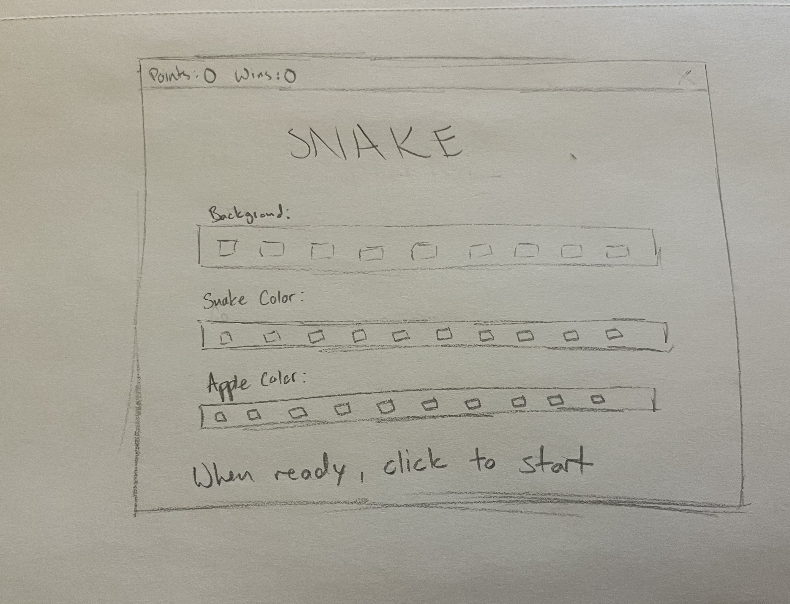
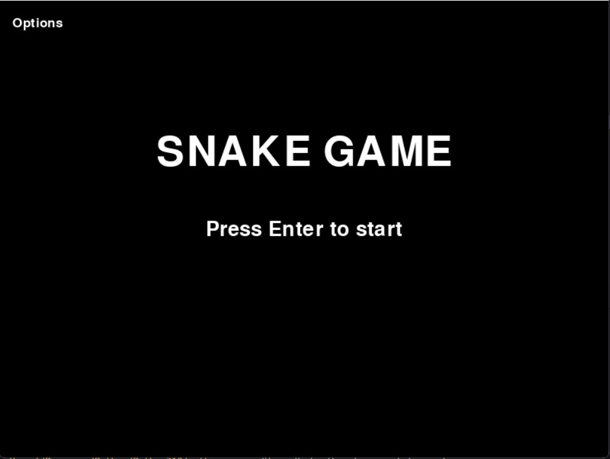

:warning: Everything between << >> needs to be replaced (remove << >> after replacing)

# Snake game
## CS110 Final Project  fall, 2023

## team members

Aidan Clarke, Kylie Robertson

***

## Project Description

 Our project is going to consist of a start screen to choose a background, color of the snake, and color of the apples. Our goal is to create a working snake game in which you are able to customize the experience. As the snake eats apples, it grows, and you beat the game by covering the entire board with the snake.

***    

## GUI Design

### Initial Design

### Final Design

## Program Design

### Features

1. Moveable snake character
2. Customizable colors (snake, background, and apples)
3. Start menu with options
4. Win screen + Game over screen
5. Visible point count and win count

### Classes

- << You should have a list of each of your classes with a description >>

## ATP

Test Case 1: Snake Movement

    Test Description: Verify that the snake moves up, down, left, and right as predicted.
    Test Steps:
    1. Start the game.
    2. Press the up arrow key.
    3. Verify that the snake moves upwards.
    4. Press the down arrow key.
    5. Verify that the snake moves downwards.
    6. Press the left arrow key.
    7. Verify that the snake moves left.
    8. Press the right arrow key.
    9. Verify that the snake moves right.
    Expected Outcome: The snake should move up, down, left, or right based on the arrow key inputs.

Test Case 2: Menu Navigation

    Test Description: Test the options avaliable on the game's main / start menu.
    Test Steps:
    1. Start the game.
    2. Navigate through the start menu options, including start game, quit, and color options.
    3. Verify that each option is clickable and leads to the named action.
    Expected Outcome: The start menu should allow the player to easily and understandable navigate through the avaliable options.

Test Case 3: Point Count

    Test Description: Verify that the point count is displayed in a readable and accurate manner.
    Test Steps:
    1. Start the game.
    2. Check for readable point counter in top corner.
    3. Each time an apple is collected, verify that the point count increases by 1.
    Expected Outcome: The point counter will be visible in the corner of the screen, increasing by 1 with each apple that is collected.

Test Case 4: Game Over Screen

    Test Description: Test that when the conditions for a game over are met, the game over screen displays.
    Test Steps:
    1. Start the game.
    2. Play until the snake collides with the wall or itself.
    3. Verify that the game over screen appears.
    Expected Outcome: When game over conditions are met, the game over screen will display.

Test Case 5: Win Screen

    Test Description: Test that when the game is won, the win screen displays.
    Test Steps:
    1. Start the game.
    2. Play until the game is won by covering the entire screen with the snake.
    3. Verify that the win screen appears.
    Expected Outcome: When the game is won, the win screen displays.

