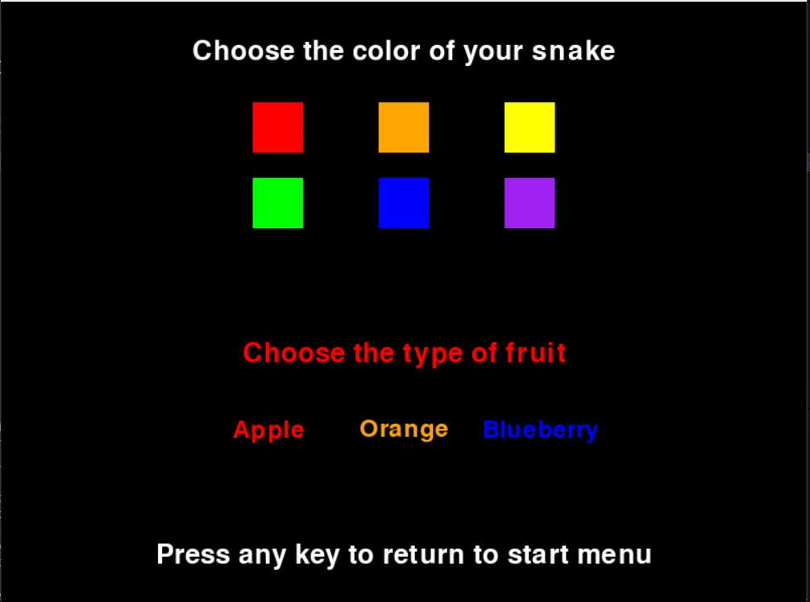

:warning: Everything between << >> needs to be replaced (remove << >> after replacing)

# Snake game
## CS110 Final Project  Fall, 2023

## Team Members

Aidan Clarke, Kylie Robertson

***

## Project Description

 Our project is going to consist of a start screen to choose the color of the snake, and the type of fruit. Our goal is to create a working snake game in which you are able to customize the experience. As the snake eats apples, it grows. If the game collides with the walls of the screen, the game is over.

***    

## GUI Design

### Initial Design

### Final Design

## Program Design

### Features

1. Moveable snake character
2. Customizable colors (snake and apples) on options screen
3. Start menu
4. Game over screen
5. Visible point count

### Classes

Class 1: Controller

    Provides the main content for the program.

Class 2: Apple

    Provides the code to create the fruit according to outside perimeters.

Class 3: Snake

    Provides the code to create the rectangle that forms the snake according to outside perimeters.

Class 4: Message

    Provides the format to create text on screen.

## ATP

Test Case 1: Snake Movement

    Test Description: Verify that the snake moves up, down, left, and right as predicted.
    Test Steps:
    1. Start the game.
    2. Press the up arrow key.
    3. Verify that the snake moves upwards.
    4. Press the down arrow key.
    5. Verify that the snake moves downwards.
    6. Press the left arrow key.
    7. Verify that the snake moves left.
    8. Press the right arrow key.
    9. Verify that the snake moves right.
    Expected Outcome: The snake should move up, down, left, or right based on the arrow key inputs.

Test Case 2: Option Menu Navigation

    Test Description: Test the options avaliable on the game's option menu
    Test Steps:
    1. Start the game.
    2. Click "options" in the top corner of the start menu.
    3. Navigate through the option menu, clicking a color option for both the snake and the fruit.
    4. Return to the start menu.
    5. Verify that the color change is reflected when starting the game.
    Expected Outcome: The option menu should allow the player to select the color of their snake and the type of fruit.

Test Case 3: Point Count

    Test Description: Verify that the point count is displayed in a readable and accurate manner.
    Test Steps:
    1. Start the game.
    2. Check for readable point counter in top corner.
    3. Each time a fruit is collected, verify that the point count increases by 1.
    Expected Outcome: The point counter will be visible in the corner of the screen, increasing by 1 with each apple that is collected.

Test Case 4: Game Over Screen

    Test Description: Test that when the conditions for a game over are met, the game over screen displays.
    Test Steps:
    1. Start the game.
    2. Play until the snake collides with the wall.
    3. Verify that the game over screen appears.
    Expected Outcome: When game over conditions are met, the game over screen will display.

Test Case 5: Snake Speed

    Test Description: Verify that as point count increases, the speed of the snake's movement increases minimally.
    Test Steps:
    1. Start the game, noting the speed of the snake.
    2. Play until a few points are collected.
    3. Verify that the speed of the snake increases.
    Expected Outcome: As the amount of points the player has increases, the speed of the snake increases minimally.

